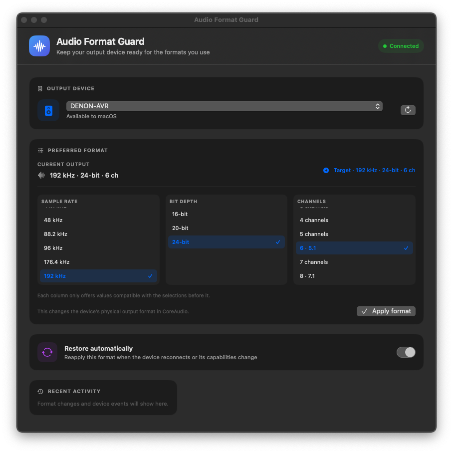
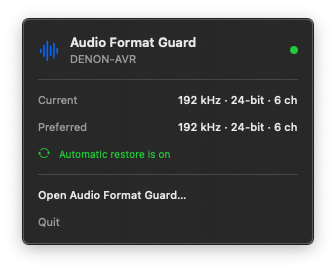

# Audio Format Guard


**Stop macOS from resetting your audio setup to stereo every time your amp powers off.**

Turn off your AV receiver, DAC, or TV, and macOS forgets your preferred audio settings—silently falling back to plain 2-channel 44.1 kHz stereo instead of the hi-res multichannel format you configured.

**Audio Format Guard** is a native macOS menu bar utility that monitors CoreAudio hardware events and automatically restores your preferred physical PCM format the instant your equipment reconnects. No more opening Audio MIDI Setup every single time you power up your sound system.

The format editor uses three linked columns: sample rate, bit depth, and channel count. Each column narrows dynamically to modes compatible with your earlier choices, guaranteeing that the requested configuration is always one your hardware actually advertises as supported.

<p align="center">
  
  &nbsp;
  
</p>

## Build and install

Requires macOS 13 or later and the Xcode Command Line Tools.
The build creates an app for the Mac architecture on which it runs, or a universal binary (`--universal`) compatible with both Apple Silicon and Intel Macs. Universal binaries and app bundles are also automatically compiled and packaged by GitHub CI/CD on every commit and release.

```sh
# Build native (or pass --universal for Apple Silicon + Intel)
./build-app.sh
./install-app.sh
```

The app appears in the menu bar. Open its window to select an output and one
of that output's reported sample-rate, bit-depth, and channel-count combinations.
Use **Apply format** to change it now. Turn on **Restore automatically** to
reapply that selected mode when CoreAudio reports a device or capability change.
Automation is off by default. Each device keeps its own mode and automation setting
in the current macOS user's preferences, keyed by the device's CoreAudio UID.

The utility does not play audio, change the system default output, alter speaker
assignments in Audio MIDI Setup, or resample application audio. CoreAudio may
reject format changes while another client holds the device or when the driver
does not permit writes. The app reports those errors in its window.

The prebuilt binaries and local builds are ad-hoc signed and not notarized through Apple's Developer Program. When downloading the prebuilt app or binary from GitHub Releases, macOS Gatekeeper flags it with a quarantine attribute.

If macOS warns that the app cannot be opened or is from an unidentified developer, strip the quarantine flag in Terminal:

```sh
# For the app bundle:
xattr -dr com.apple.quarantine "/Applications/Audio Format Guard.app"
# Or in the directory where you unzipped:
xattr -dr com.apple.quarantine "Audio Format Guard.app"

# For the standalone executable:
xattr -d com.apple.quarantine AudioFormatGuard
chmod +x AudioFormatGuard
```

Alternatively, Control-click (or right-click) `Audio Format Guard.app` in Finder, choose **Open**, and click **Open** in the dialog.


Remove its login service with:

```sh
./uninstall-app.sh
```

## How it works

`AudioDeviceManager` reads output devices and physical stream formats from the
CoreAudio HAL. Device profiles are keyed by the device UID, not its display name,
and remain in the signed-in user's preferences. CoreAudio property listeners
schedule a debounced refresh when devices, streams, or formats change. If automatic
restore is enabled for that device, the manager sets the selected advertised
physical PCM format. It does not poll or play a probe tone.

The window shows the current physical format next to the preferred target. A
manual **Apply format** action works even when automatic restore is off. Recent
activity and CoreAudio errors are shown in the window to make rejected changes
visible.

For design decisions and implementation details, see [ARCHITECTURE.md](ARCHITECTURE.md). For release history, see [CHANGELOG.md](CHANGELOG.md).

## Limitations

Current format choices cover advertised signed-integer linear PCM combinations.
Float PCM, compressed passthrough, DSD, and channel-layout remapping are outside
this first version. Devices exposing output as multiple independent streams are
listed, but a requested mode must be supported by one stream.

## License

Audio Format Guard is released under the MIT License. See [LICENSE](LICENSE).

The menu bar app and format editor require a logged-in macOS GUI session. The
LaunchAgent opens the app at login; the audio format itself remains unchanged
unless a user applies it or enables automatic restore. Switching a live device
format may interrupt playback briefly, depending on its driver and clients.

This avoids hard-coding one device name or format into a one-off watcher. Do not
run multiple automatic format controllers against the same output: they can
compete to set CoreAudio's physical mode.
